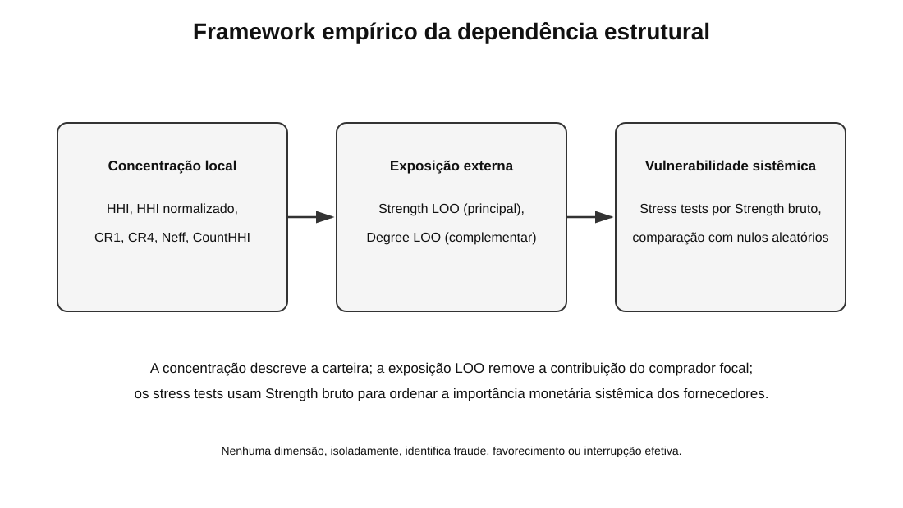
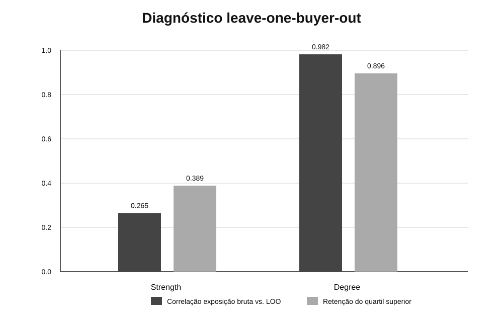
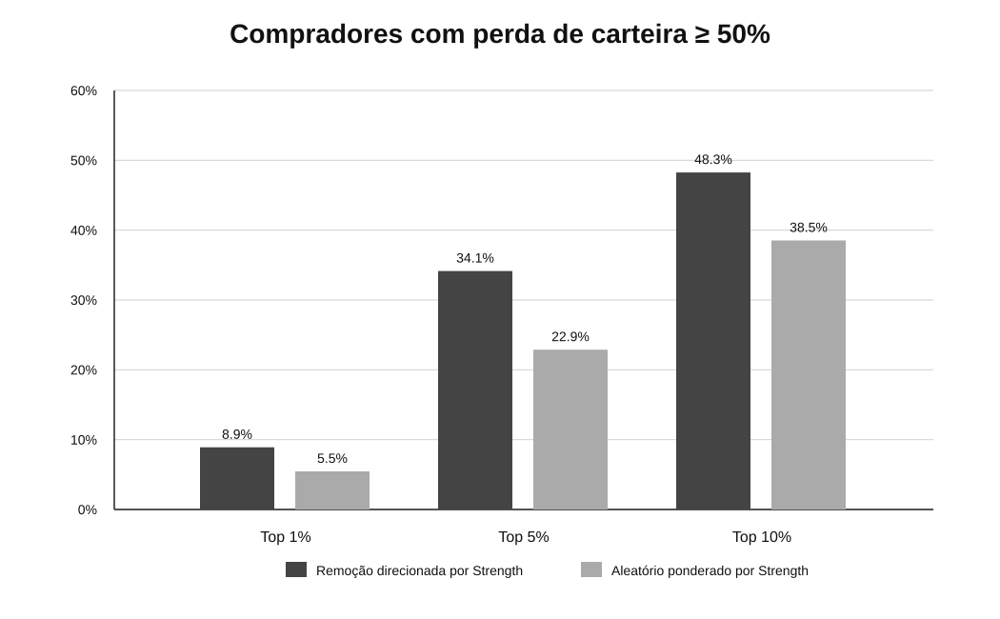
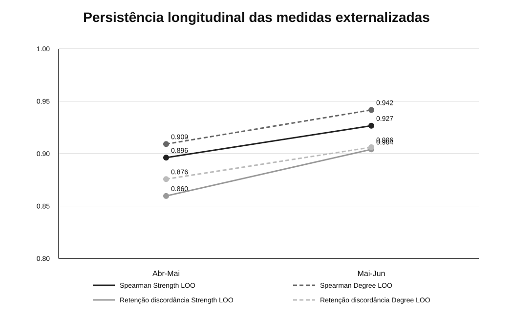

# Dependência Estrutural de Fornecedores nas Compras Públicas Municipais: Concentração da Carteira, Exposição Externa em Rede e Testes de Estresse

## Structural Supplier Dependency in Municipal Public Procurement: Portfolio Concentration, External Network Exposure, and Stress Tests

**Versão preprint:** 20 de agosto de 2026  
**JEL:** H57; D85; C55

## Resumo

Este estudo investiga dependência de fornecedores em compras públicas municipais a partir de três dimensões analiticamente distintas: concentração monetária dentro da carteira de cada comprador, exposição externa a fornecedores relevantes na rede de contratação e vulnerabilidade mecânica a choques coletivos de fornecedores. Utilizamos dados do Portal Nacional de Contratações Públicas referentes a instrumentos publicados entre janeiro e junho de 2025, restringindo as métricas econômicas a instrumentos assinados em 2025 e a fornecedores pessoa jurídica. A unidade de comprador é o CNPJ institucional do órgão do Poder Executivo municipal. A concentração local é medida por HHI, HHI normalizado, CR1, CR4, número efetivo de fornecedores e CountHHI. Para separar a posição externa do fornecedor da contribuição do próprio comprador, construímos exposições leave-one-buyer-out (LOO) baseadas em Strength e Degree. A robustez mostra que a exposição calculada com Strength bruto contém forte componente de auto-inclusão, enquanto Strength LOO e Degree LOO apresentam elevada concordância entre si e associação muito baixa com HHI. A discordância entre concentração e exposição permanece identificável com ambas as medidas externalizadas e apresenta elevada persistência entre abril e junho. Nos testes de estresse, a remoção dos fornecedores de maior Strength produz perdas de carteira superiores às observadas em sorteios de igual tamanho ponderados por Strength. Modelos associativos complementares indicam que recorrência contratual tem associação frágil com concentração local, mas associação positiva e consistente com exposição externa. Os resultados mostram que dependência de fornecedores em compras públicas municipais não pode ser inferida apenas pela concentração observada dentro de cada carteira.

**Palavras-chave:** compras públicas; fornecedores; concentração; redes; dependência estrutural; PNCP; centralidade; testes de estresse.

## Abstract

This study examines supplier dependency in municipal public procurement through three analytically distinct dimensions: monetary concentration within each buyer's supplier portfolio, external exposure to suppliers occupying relevant positions in the procurement network, and mechanical vulnerability to collective supplier shocks. We use data from Brazil's National Public Procurement Portal for instruments published from January through June 2025, restricting economic metrics to instruments signed in 2025 and to corporate suppliers. The buyer unit is the institutional tax identifier of municipal executive-branch entities. Local concentration is measured using HHI, normalized HHI, CR1, CR4, effective number of suppliers, and CountHHI. To separate external supplier position from the focal buyer's own contribution, we construct leave-one-buyer-out (LOO) exposure measures based on supplier Strength and Degree. Robustness tests show that raw Strength-based buyer exposure contains substantial self-inclusion, whereas Strength LOO and Degree LOO are highly concordant with each other and only weakly related to HHI. Concentration-exposure discordance remains identifiable under both externalized measures and is highly persistent from April through June. In stress tests, removing the highest-Strength suppliers generates larger portfolio losses than equally sized random removals weighted by Strength. Complementary associative models indicate that contractual recurrence is weakly associated with local concentration but positively and consistently associated with external exposure. The findings show that supplier dependency in municipal public procurement cannot be inferred from within-portfolio concentration alone.

**Keywords:** public procurement; suppliers; concentration; networks; structural dependency; centrality; stress testing.

# 1. Introdução

A gestão da base de fornecedores envolve um problema que não pode ser resumido pelo número de empresas contratadas. Mesmo quando um comprador distribui seu valor entre diversos fornecedores, parte relevante de sua carteira pode estar vinculada a empresas que ocupam posições importantes fora daquela relação focal. Inversamente, um comprador pode apresentar forte concentração interna e depender de fornecedores com alcance externo limitado. Essas configurações produzem vulnerabilidades diferentes e exigem métricas diferentes.

A literatura de supply management tem utilizado versões do índice Herfindahl-Hirschman (HHI) para medir concentração da base de fornecedores a partir das participações do gasto do comprador, distinguindo esse uso do HHI de sua aplicação tradicional a mercados relevantes (Sharma et al., 2026). Na literatura de compras públicas, estudos recentes mostram que relações entre autoridades contratantes e fornecedores podem ser estudadas como redes e que centralidade, recorrência, concentração e embeddedness contêm informação adicional sobre a estrutura da contratação (Fountoukidis et al., 2023; Pliatsidis, 2024; Sturm et al., 2025; Fountoukidis et al., 2026a).

Essa literatura também impõe duas cautelas. Primeiro, concentração e recorrência são sinais estruturais e não evidência isolada de fraude, favorecimento ou conluio. Estudos que usam redes para investigar riscos de integridade combinam estruturas relacionais com indicadores adicionais e interpretações contextuais (Wachs et al., 2021; Waxenecker & Prell, 2024). Segundo, uma métrica de exposição baseada na centralidade global de um fornecedor pode reutilizar a contribuição do próprio comprador focal. Sem corrigir essa auto-inclusão, uma medida apresentada como exposição externa pode refletir parcialmente a escala ou concentração da própria carteira.

Este artigo trata a dependência estrutural de fornecedores como um framework com três componentes:

1. **concentração local da carteira**, definida pela distribuição monetária e pela frequência de instrumentos entre os fornecedores do comprador;
2. **exposição externa em rede**, definida pela posição dos fornecedores depois de retirada a contribuição do comprador focal;
3. **vulnerabilidade sistêmica**, medida por testes de estresse que simulam a remoção de conjuntos de fornecedores sistemicamente relevantes.

**Figura 1.** Framework empírico. Concentração local, exposição externa e vulnerabilidade sistêmica são dimensões relacionadas, mas não intercambiáveis.

A pergunta de pesquisa é:

> Em que medida medidas locais de concentração da carteira capturam, ou deixam de capturar, a exposição externa de compradores públicos municipais a fornecedores estruturalmente relevantes, e como essa diferença se manifesta sob choques coletivos simulados?

A contribuição é metodológica e empírica. Não propomos novidade isolada para HHI, Degree, Strength, recorrência ou redes bipartidas. O avanço está em integrar medidas de concentração da carteira com exposição LOO, discordância concentração-exposição, testes de estresse e validação longitudinal, aplicando o framework a compradores municipais brasileiros observados no PNCP.

# 2. Literatura e posicionamento da contribuição

## 2.1 Concentração e redes em compras públicas

Fountoukidis, Antoniou e Varsakelis (2023) propõem monitoramento das condições competitivas em compras públicas por meio de entropia de rede e métricas de agentes. Pliatsidis (2024) utiliza redes para estudar concentração em grupos CPV da contratação pública grega e evidencia heterogeneidade entre segmentos. Sturm et al. (2025), com mais de um milhão de contratos portugueses, mostram que redes de compras públicas apresentam estrutura modular e hierárquica e que posições de influência das firmas estão relacionadas a maiores ganhos por lance.

Esses trabalhos justificam o uso de redes como instrumento descritivo, mas não eliminam a necessidade de definir corretamente a unidade econômica. Neste estudo, o HHI não é interpretado como concentração antitruste de mercado relevante. Ele mede **concentração da carteira de fornecedores de um comprador institucional**. Essa escolha é importante porque a classificação disponível no PNCP não foi tratada como suficiente para definir mercados econômicos comparáveis em todas as contratações analisadas.

No campo mais amplo de relações comprador-fornecedor, Sharma et al. (2026) aplicam HHI às participações do custo de insumos por fornecedor e mostram que concentração da base de fornecedores é um constructo diferente de simples contagem. Essa lógica sustenta nossa interpretação do HHI como medida interna da carteira.

## 2.2 Recorrência, persistência e fechamento relacional

Popa (2019) mostra que vínculos repetidos entre autoridades e firmas podem emergir sob diferentes configurações institucionais e não devem ser interpretados automaticamente como comportamento impróprio. Em trabalho recente, Fountoukidis, Dafli, Antoniou e Varsakelis (2026a) propõem o *Institutional Closure Index*, combinando concentração, persistência e embeddedness no nível da autoridade contratante. Em outro estudo, os mesmos autores analisam recorrência como sinal de governança e mostram elevada previsibilidade de relações repetidas em diferentes domínios da contratação pública grega (Fountoukidis et al., 2026b).

Nosso framework é complementar. Em vez de produzir um índice agregado de fechamento, separamos concentração local e exposição externa e verificamos a persistência dessas dimensões ao longo das coortes acumuladas. A recorrência entra como característica da carteira e como covariável nos modelos associativos, sem ser tratada como irregularidade.

## 2.3 Valor contratado e frequência de contratos

O contraste entre valor e contagem também ganhou atenção recente. Fountoukidis (2026) mostra, em dados europeus, que participação de fornecedores e captura de valor podem divergir substancialmente. Isso é diretamente relevante para o nosso CountHHI. Portanto, não reivindicamos novidade para a constatação de que contagem e valor podem gerar rankings ou padrões diferentes. Nossa utilização do CountHHI serve para caracterizar a divergência no nível da carteira municipal e para demonstrar que a concentração monetária não é substituível pela frequência de instrumentos.

## 2.4 Redes, risco e interpretação prudente

Wachs, Fazekas e Kertész (2021) e Waxenecker e Prell (2024) mostram como redes podem ser usadas em análises de risco de corrupção e de dinâmica relacional. Esses trabalhos, entretanto, combinam métricas de rede com desenhos e indicadores especificamente orientados a risco de integridade. O presente estudo não faz esse salto inferencial. HHI, centralidade, recorrência, persistência e stress tests são tratados como diagnósticos estruturais. Não identificam, isoladamente, fraude, favorecimento, conluio, risco de crédito ou interrupção de serviços.

## 2.5 Contexto brasileiro e lacuna empírica

Fonseca (2025) aplica teoria de redes a contratações públicas federais brasileiras entre 2022 e meados de 2024. O presente trabalho desloca a unidade empírica para compradores municipais, utiliza o CNPJ institucional como comprador, integra concentração da carteira com exposição externalizada e adiciona testes de estresse e validação temporal.

A contribuição defendida é, portanto, específica: **um framework de mensuração que separa concentração interna, posição externa e vulnerabilidade sistêmica e demonstra empiricamente que essas dimensões não são redundantes**.

# 3. Dados e desenho empírico

## 3.1 PNCP e regra temporal

A fonte principal é o Portal Nacional de Contratações Públicas (PNCP), cuja plataforma disponibiliza APIs públicas para consulta de contratos e empenhos por data de publicação. A coleta operacional é realizada pela data de publicação do instrumento.

A janela deste paper compreende publicações de 01/01/2025 a 30/06/2025. Para as métricas econômicas são utilizados apenas instrumentos assinados em 2025, com `valorInicial > 0`, pertencentes à esfera municipal e ao Poder Executivo.

A janela deve ser entendida como **coorte de publicações acumuladas janeiro-junho**, e não como o ano de 2025 completo. Instrumentos assinados em 2025 e publicados depois de junho não pertencem a esta coorte. O segundo paper utilizará janeiro-dezembro e, posteriormente, a captura tardia de 2026 antes do congelamento da base anual.

## 3.2 Unidade institucional e chaves

O comprador principal é o CNPJ institucional do órgão ou entidade do instrumento. O município funciona como dimensão territorial e fonte de controles fiscais, não como substituto da unidade institucional de comprador.

A chave de instrumento é `numeroControlePNCP`, materializada nas bases analíticas como `id_contrato`. `numeroControlePNCPCompra` é usado apenas para ligação com a compra e nunca para deduplicar instrumentos.

## 3.3 Privacidade

A base pública identificada contém somente fornecedores pessoa jurídica. Registros de pessoa física e pessoa estrangeira permanecem apenas em diagnósticos agregados, sem republicação de CPF ou nome de pessoa física.

## 3.4 Amostra e estatísticas descritivas

**Tabela 1. Amostra e métricas principais, janeiro-junho de 2025**

| Indicador | Valor |
|---|---:|
| Instrumentos PJ únicos na coorte | 105.582 |
| Instrumentos assinados em 2025 | 98.438 |
| Compradores com métricas | 2.349 |
| Compradores elegíveis, >=3 fornecedores e >=5 instrumentos | 1.347 |
| Fornecedores na rede global | 20.367 |
| HHI monetário mediano | 0,2365 |
| HHI normalizado mediano | 0,1563 |
| CountHHI mediano | 0,0816 |
| Número efetivo de fornecedores, mediana | 4,23 |
| CR1 mediano | 0,3837 |
| CR4 mediano | 0,8037 |
| Compradores com HHI monetário > CountHHI | 98,14% |

Fonte: elaboração própria a partir do PNCP. Arquivo reproduzível: `tables/tabela_1_amostra_metricas.csv`.

# 4. Medidas

## 4.1 Concentração local

Para comprador `b` e fornecedor `j`, seja `V_bj` o valor acumulado da relação comprador-fornecedor e:

`w_bj = V_bj / sum_j(V_bj)`

O HHI monetário da carteira é:

`HHI_b = sum_j(w_bj^2)`

Com `N_b` fornecedores:

`HHI_norm_b = (HHI_b - 1/N_b) / (1 - 1/N_b)`

Também são calculados:

- CR1;
- CR4;
- número efetivo de fornecedores, `Neff = 1/HHI`;
- CountHHI e CountHHI normalizado, baseados na frequência de instrumentos.

Essas métricas descrevem a distribuição da carteira do comprador e não constituem medida de concentração antitruste de mercado relevante.

## 4.2 Rede comprador-fornecedor

A rede é bipartida e ponderada pelo valor acumulado das relações. De um lado estão compradores institucionais; do outro, fornecedores PJ.

O Strength global do fornecedor é:

`Strength_j = sum_b(V_bj)`

Degree é o número de compradores distintos atendidos pelo fornecedor:

`Degree_j = count_distinct(b | V_bj > 0)`

Strength bruto mede a massa monetária observada no sistema e permanece o ranking principal dos testes de estresse. Degree mede alcance institucional e é complementar.

## 4.3 Exposição leave-one-buyer-out

Para medir posição externa, retiramos do fornecedor a contribuição do comprador focal:

`Strength_j^(-b) = Strength_j - V_bj`

`Degree_j^(-b) = Degree_j - I(V_bj > 0)`

A posição percentual dos fornecedores é recalculada na rede ajustada ao comprador focal. As exposições são:

`E_b^(S,LOO) = sum_j w_bj * PctRank_b(Strength_j^(-b))`

`E_b^(D,LOO) = sum_j w_bj * PctRank_b(Degree_j^(-b))`

Strength LOO é a medida preferencial de exposição externa; Degree LOO funciona como verificação complementar.

## 4.4 Discordância concentração-exposição

A classificação principal utiliza o quadrante:

`HHI_b < Q75(HHI)` e `Exposição_b >= Q75(Exposição)`.

Esse grupo é denominado **discordância concentração-exposição** ou **exposição externa não capturada pelo HHI**. O corte não define “baixa concentração” em sentido absoluto e não representa risco anormal. Sob independência entre dois indicadores contínuos com cortes Q75, o benchmark mecânico do quadrante é 18,75%.

## 4.5 Testes de estresse

Os testes removem os top 1%, 5% e 10% dos fornecedores segundo Strength bruto e medem a fração da carteira de cada comprador associada aos fornecedores removidos. O resultado principal é a proporção de compradores cuja perda simulada alcança pelo menos 50% da carteira.

Além do sorteio aleatório uniforme histórico, utilizamos um benchmark mais exigente: sorteios de igual tamanho, sem reposição, com probabilidade proporcional ao Strength do fornecedor. Cada cenário usa 1.000 replicações com semente fixa.

Os testes são mecânicos. Não modelam default, capacidade produtiva, substituição, renegociação ou interrupção efetiva de serviços.

# 5. Resultados

## 5.1 Concentração monetária e frequência não são equivalentes

O HHI monetário mediano é 0,2365, enquanto o CountHHI mediano é 0,0816. Em 98,14% dos compradores elegíveis o HHI monetário supera o CountHHI. A correlação entre HHI monetário e CountHHI é positiva, mas incompleta (`rho = 0,5678`).

Esse resultado é compatível com a literatura recente sobre divergência entre participação e captura de valor em compras públicas (Fountoukidis, 2026). No presente estudo, ele demonstra que o número ou a frequência de instrumentos não substituem a distribuição monetária da carteira.

## 5.2 O Strength bruto contém auto-inclusão quando usado como exposição do comprador

A robustez LOO identifica uma diferença substantiva entre Strength e Degree.

**Tabela 2. Diagnóstico leave-one-buyer-out**

| Métrica | Strength | Degree |
|---|---:|---:|
| Correlação exposição bruta vs. LOO | 0,2647 | 0,9821 |
| Retenção do quartil superior | 38,87% | 89,61% |
| Correlação HHI_norm vs. exposição LOO | -0,0183 | -0,0763 |
| Compradores em discordância | 221, 16,41% | 237, 17,59% |

Fonte: `results/robustez_estrutural_2025_06/`. Arquivo: `tables/tabela_2_diagnostico_loo.csv`.

**Figura 2.** A exposição Strength bruta muda substancialmente após a retirada da contribuição do comprador focal. Degree é muito mais estável ao procedimento LOO.

A correlação de apenas 0,2647 entre Strength bruto e Strength LOO e a retenção de 38,87% do quartil superior mostram que a medida bruta não pode ser interpretada como exposição puramente externa. A contribuição própria mediana ponderada do comprador ao Strength dos fornecedores de sua carteira é 75,89%.

Em contraste, a correlação entre Degree bruto e Degree LOO é 0,9821, com retenção de 89,61% do quartil superior. A implicação metodológica é direta: **Strength bruto continua adequado para ordenar importância monetária sistêmica, mas a exposição externa do comprador deve ser calculada após a retirada da relação focal**.

## 5.3 Concentração local e exposição externa apresentam baixa redundância

Strength LOO e Degree LOO apresentam correlação de `rho = 0,9500` entre si. Depois da externalização, entretanto, a relação com HHI praticamente desaparece:

- HHI normalizado x Strength LOO: `rho = -0,0183`, `p = 0,502`;
- HHI normalizado x Degree LOO: `rho = -0,0763`, `p = 0,0051`.

A segunda correlação é estatisticamente diferente de zero, mas pequena em magnitude. O resultado substantivo é a baixa redundância entre concentração interna e posição externa dos fornecedores.

A classificação de discordância identifica 221 compradores, 16,41% dos elegíveis, usando Strength LOO, e 237, 17,59%, usando Degree LOO. A sobreposição entre as duas classificações é 89,14%. Como o benchmark mecânico sob independência é 18,75%, esses percentuais não devem ser apresentados como prevalência anormal. A evidência relevante é a existência de uma dimensão externa que o HHI não resume e a elevada concordância entre duas medidas LOO.

## 5.4 Testes de estresse

**Tabela 3. Testes de estresse por Strength bruto**

| Fornecedores removidos | k | Direcionado: compradores com perda >=50% | Aleatório ponderado por Strength | Massa de Strength nos top-k |
|---|---:|---:|---:|---:|
| Top 1% | 204 | 8,91% | 5,46% | 57,56% |
| Top 5% | 1.019 | 34,15% | 22,88% | 79,47% |
| Top 10% | 2.037 | 48,26% | 38,52% | 87,41% |

Fonte: `results/robustez_estrutural_2025_06/`. Arquivo: `tables/tabela_3_stress_test.csv`.

**Figura 3.** Proporção de compradores com perda simulada de pelo menos 50% da carteira sob remoção direcionada e sorteios de igual tamanho ponderados por Strength.

Nos três níveis de remoção, a perda severa sob ataque direcionado supera a média dos sorteios ponderados. Além disso, o valor direcionado fica acima do percentil 97,5% da distribuição aleatória ponderada em todos os casos. O contraste permanece, portanto, mesmo quando o benchmark favorece a seleção de fornecedores de maior Strength.

O resultado também revela forte concentração da massa sistêmica: os top 1%, 5% e 10% concentram 57,56%, 79,47% e 87,41% do Strength observado. Um diagnóstico adicional calcula quantos fornecedores aleatórios seriam necessários para atingir massa semelhante, mas não é tratado como contrafactual de superioridade porque altera o número de fornecedores removidos.

# 6. Persistência longitudinal e efeito de composição

A persistência foi recalculada com Strength LOO e Degree LOO. O objetivo é avaliar estabilidade de screening sem reutilizar a exposição Strength bruta.

**Tabela 4. Persistência das medidas externalizadas**

| Transição | Compradores comuns | rho Strength LOO | rho Degree LOO | Retenção discordância Strength | Retenção discordância Degree |
|---|---:|---:|---:|---:|---:|
| Abril-maio | 1.013 | 0,8962 | 0,9091 | 85,96% | 87,57% |
| Maio-junho | 1.210 | 0,9266 | 0,9416 | 90,40% | 90,61% |

Fonte: `results/diagnosticos_longitudinais_loo_jan_jun_2025/`. Arquivo: `tables/tabela_4_persistencia.csv`.

**Figura 4.** Correlações de ranking e retenção da classificação de discordância nas transições abril-maio e maio-junho.

A persistência aumenta nas duas medidas entre as duas transições. Isso sustenta a interpretação de estabilidade do screening, sem transformar a classificação em rótulo causal ou permanente de risco.

A mudança transversal também contém efeito de composição. Entre maio e junho, o número de compradores elegíveis cresce de 1.210 para 1.347, com 137 entrantes e nenhuma saída. Os entrantes apresentam HHI mediano de 0,3606, superior ao HHI mediano de 0,2233 entre compradores persistentes em junho. Em sentido oposto, apresentam exposição externa mediana inferior: Strength LOO de 0,2048 contra 0,3106 nos compradores comuns e Degree LOO de 0,1996 contra 0,3044. Logo, mudanças das medianas agregadas podem refletir simultaneamente evolução dentro dos compradores persistentes e entrada de unidades com perfil diferente.

# 7. Integração fiscal e modelos associativos

A integração fiscal usa dados municipais do SICONFI. Na janela janeiro-junho, 1.346 compradores possuem vínculo municipal único, 1.335 possuem despesa empenhada disponível e 725 municípios integram a amostra modelada. A cobertura de despesa é 99,18%.

Os modelos são associativos. Não identificam efeitos causais.

A especificação de concentração utiliza:

`HHI_norm_b = beta0 + beta1 ln(Pop_b) + beta2 ln(DespesaPC_b) + beta3 ln(NFornec_b) + beta4 ln(InstrPorFornec_b) + Região + erro_b`

As robustezes adicionadas são:

1. WLS no nível comprador com peso `1/N_m`, em que `N_m` é o número de compradores elegíveis do município;
2. modelos agregados ao município;
3. CR1 e CR4 como outcomes alternativos ao HHI normalizado;
4. Strength LOO e Degree LOO como outcomes de exposição externa.

**Tabela 5. Coeficientes-chave das robustezes associativas**

| Outcome / modelo | ln população | ln despesa pc | ln n fornecedores | ln instrumentos/fornecedor |
|---|---:|---:|---:|---:|
| HHI_norm WLS | 0,0206*** | 0,0005 | -0,0715*** | 0,0301† |
| HHI_norm agregado municipal | 0,0207*** | 0,0007 | -0,0753*** | 0,0264 |
| Strength LOO WLS | -0,0311*** | -0,0664* | 0,0072 | 0,1556*** |
| Strength LOO agregado municipal | -0,0298*** | -0,0638* | 0,0104 | 0,2076*** |
| Degree LOO WLS | -0,0276*** | -0,0563† | -0,0055 | 0,2009*** |
| Degree LOO agregado municipal | -0,0260*** | -0,0531† | 0,0005 | 0,2694*** |

Notas: *** `p < 0,001`; * `p < 0,05`; † `p < 0,10`. Modelos com controles de macrorregião. Arquivo: `tables/tabela_5_modelos.csv`.

Nos modelos de concentração, população mantém associação positiva, despesa per capita não apresenta padrão robusto e número de fornecedores mantém associação negativa, que deve ser tratada como estrutural porque se relaciona matematicamente ao HHI. Recorrência perde robustez quando o peso municipal é equalizado.

Nos modelos de exposição externa, o número de fornecedores deixa de apresentar associação substantiva. Recorrência, por outro lado, permanece positiva e estatisticamente precisa nas quatro especificações LOO. A formulação adequada é:

> **recorrência contratual apresenta associação frágil com concentração local, mas associação positiva e consistente com exposição externa a fornecedores conectados a outros compradores.**

Esse padrão é descritivo-associativo e não deve ser interpretado como efeito causal da recorrência sobre exposição.

# 8. Discussão

Os resultados sustentam quatro conclusões principais.

Primeiro, concentração monetária e frequência de instrumentos não são intercambiáveis. A distribuição de valor é consideravelmente mais desigual que a distribuição de contagem para a maioria dos compradores. Esse resultado aproxima o estudo do debate recente sobre divergência entre participação e captura de valor, mas sua função aqui é caracterizar a carteira, não propor uma nova medida geral de competição.

Segundo, a correção LOO é decisiva. O Strength bruto é útil para medir importância sistêmica monetária, mas inadequado como medida de exposição puramente externa do comprador, porque a relação focal contribui diretamente para o ranking do fornecedor. A retirada dessa contribuição reduz fortemente a correlação entre a exposição Strength bruta e a externalizada. Degree é muito mais estável, e Strength LOO e Degree LOO convergem entre si depois da correção.

Terceiro, a correção torna mais nítida a distinção entre concentração local e exposição externa. A quase ausência de correlação entre HHI e Strength LOO mostra que um painel baseado apenas em concentração da carteira pode omitir informação relacional relevante. Isso não significa que a exposição externa seja, por si, “risco”. Significa que ela mede outra dimensão do sistema observado.

Quarto, os testes de estresse demonstram concentração sistêmica da massa monetária. A remoção dos fornecedores de maior Strength produz perdas superiores até mesmo a um benchmark aleatório que seleciona fornecedores com probabilidade proporcional ao Strength. A interpretação adequada é vulnerabilidade mecânica da rede observada, não previsão de falha.

Essa separação é coerente com recomendações de resiliência em compras públicas que enfatizam diversificação da base de fornecedores e monitoramento da cadeia, mas o presente estudo não mede criticidade de itens, capacidade de substituição ou continuidade operacional (OECD, 2024). Para uso gerencial, as métricas devem funcionar como triagem para análises posteriores.

# 9. Implicações para screening e governança

Um painel de dependência pode combinar concentração local e exposição externa em quatro quadrantes:

| Concentração local | Exposição externa | Interpretação de screening |
|---|---|---|
| menor | menor | carteira relativamente diversificada e fornecedores menos centrais externamente |
| maior | menor | dependência predominantemente local |
| menor | maior | exposição externa não capturada pelo HHI |
| maior | maior | concentração local combinada com exposição externa elevada |

Os termos “menor” e “maior” são relativos ao critério de classificação utilizado na amostra e não equivalem a limites regulatórios. O quadrante serve para priorizar investigação, não para classificar irregularidade.

Uma análise material de dependência exigiria, entre outros elementos:

- criticidade do objeto contratado;
- disponibilidade de fornecedores substitutos;
- tempo de reposição ou transição;
- capacidade produtiva e financeira;
- concentração por categoria econômica defensável;
- condições de mercado e barreiras de entrada;
- cláusulas contratuais e mecanismos de continuidade.

# 10. Limitações

Este estudo possui limitações que delimitam o alcance das conclusões:

1. a janela janeiro-junho é uma coorte parcial de publicações e não representa o ano de 2025 completo;
2. instrumentos assinados no período podem ser publicados posteriormente;
3. `valorInicial` representa valor do instrumento e não execução financeira;
4. a cobertura empírica depende do que foi publicado no PNCP segundo os filtros documentados;
5. Strength representa massa monetária observada, não capacidade produtiva ou criticidade do fornecedor;
6. Degree representa alcance institucional, não substituibilidade;
7. os testes de estresse não modelam adaptação, substituição, renegociação, estoque ou continuidade operacional;
8. a classificação de discordância é relativa à distribuição observada e não um limiar normativo;
9. o escopo principal é Poder Executivo municipal;
10. modelos fiscais são associativos e não causais;
11. nenhuma métrica utilizada identifica, isoladamente, fraude, favorecimento ou conluio;
12. parte da literatura mais diretamente comparável de 2026 ainda consiste em working papers ou discussion papers e deve ser acompanhada até eventual publicação revisada por pares.

# 11. Conclusão

A dependência de fornecedores nas compras públicas municipais não se reduz à concentração interna das carteiras. O principal resultado metodológico deste estudo é que importância sistêmica do fornecedor e exposição externa do comprador precisam ser separadas.

A exposição baseada diretamente em Strength global é fortemente influenciada pela contribuição monetária do próprio comprador. Quando essa contribuição é retirada, Strength LOO e Degree LOO passam a fornecer medidas convergentes de exposição externa e apresentam relação muito pequena com o HHI. Essa correção fortalece, em vez de enfraquecer, a tese central: concentração local e exposição externa são dimensões distintas.

A classificação de discordância concentração-exposição permanece semelhante sob Strength LOO e Degree LOO e apresenta alta persistência nas transições abril-maio e maio-junho. Os testes de estresse preservam outra função do Strength bruto: os fornecedores de maior massa monetária no sistema geram perdas simuladas superiores às de sorteios aleatórios comparáveis em número e enviesados pelo próprio Strength.

O framework final combina três camadas: concentração local, exposição externa e vulnerabilidade sistêmica. Seu uso adequado é diagnóstico e de screening. O segundo paper aplicará a mesma arquitetura ao ano completo de 2025, preservando metodologia, chaves e regras de interpretação, e testará estabilidade temporal, efeito de composição e sensibilidade à captura tardia de publicações em 2026.

# Referências

Brasil. Ministério da Gestão e da Inovação em Serviços Públicos. (2026). *Portal Nacional de Contratações Públicas: Dados Abertos*. https://www.gov.br/pncp/pt-br/acesso-a-informacao/dados-abertos

Brasil. Secretaria do Tesouro Nacional. (2026). *SICONFI: documentação e Declaração de Contas Anuais*. https://www.siconfi.tesouro.gov.br/siconfi/pages/public/conteudo/conteudo.jsf?id=46903

Fonseca, F. T. (2025). *Patterns in Public Contracting: A Network Theory Perspective on Procurement Dynamics in Brazil* [Master's dissertation, NOVA Information Management School]. http://hdl.handle.net/10362/190144

Fountoukidis, I. G., Antoniou, I. E., & Varsakelis, N. C. (2023). Competitive conditions in the public procurement markets: an investigation with network analysis. *Journal of Industrial and Business Economics, 50*, 347-368. https://doi.org/10.1007/s40812-022-00251-z

Fountoukidis, I., Dafli, E., Antoniou, I., & Varsakelis, N. (2026a). *Measuring Institutional Closure in Public Procurement: A Network-Based Index from European Buyer-Supplier Data*. SSRN working paper. https://doi.org/10.2139/ssrn.6765160

Fountoukidis, I. G., Dafli, E. L., Antoniou, I. E., & Varsakelis, N. C. (2026b). *Recurrence as a Governance Signal: Diagnostic Network Metrics for Public Procurement Oversight in Greece*. GreeSE Papers on Greece and Southeast Europe, No. 219, Hellenic Observatory, London School of Economics and Political Science.

Fountoukidis, I. (2026). *Many Suppliers Win, Few Capture the Value: Participation and Value Concentration in EU Public Procurement*. SSRN working paper. https://doi.org/10.2139/ssrn.6897598

Herfindahl, O. C. (1950). *Concentration in the U.S. Steel Industry* [Doctoral dissertation, Columbia University].

Hirschman, A. O. (1945). *National Power and the Structure of Foreign Trade*. University of California Press.

Newman, M. E. J. (2010). *Networks: An Introduction*. Oxford University Press.

OECD. (2024). *Toolkit for Resilient Public Procurement Strategies to Minimise Risks of Supply Disruption*. OECD.

Pliatsidis, A. C. (2024). Analyzing concentration in the Greek public procurement market: a network theory approach. *Journal of Industrial and Business Economics, 51*, 431-480. https://doi.org/10.1007/s40812-023-00291-z

Popa, M. (2019). Uncovering the structure of public procurement transactions. *Business and Politics, 21*(3), 351-384. https://doi.org/10.1017/bap.2019.1

Sharma, A., Saboo, A. R., Borah, S. B., & Adhikary, A. (2026). Supplier concentration and firm performance: the role of relative size, relative reputation, and network position. *International Journal of Research in Marketing*. Advance online publication. https://doi.org/10.1016/j.ijresmar.2026.01.006

Sturm, N. F., Candia, C., Damásio, B., & Pinheiro, F. L. (2025). High earnings through firm influence: the role of hierarchical structures in public procurement. *EPJ Data Science, 14*, Article 27, 1-20. https://doi.org/10.1140/epjds/s13688-025-00543-z

Wachs, J., Fazekas, M., & Kertész, J. (2021). Corruption risk in contracting markets: a network science perspective. *International Journal of Data Science and Analytics, 12*, 45-60. https://doi.org/10.1007/s41060-019-00204-1

Waxenecker, H., & Prell, C. (2024). Corruption dynamics in public procurement: A longitudinal network analysis of local construction contracts in Guatemala. *Social Networks, 79*, 154-167. https://doi.org/10.1016/j.socnet.2024.07.001

# Reprodutibilidade e disponibilidade de dados

O repositório contém scripts, bases públicas minimizadas, resultados e logs necessários para auditar as análises. Bases identificadas publicadas contêm apenas fornecedores pessoa jurídica.

## Scripts principais

- `scripts/analisar_acumulado_2025_global.py`
- `scripts/robustez_estrutural_generica.py`
- `scripts/robustez_modelos_municipio_generica.py`
- `scripts/calcular_exposicao_loo_generica.py`
- `scripts/diagnosticos_longitudinais_loo_jan_jun_2025.py`

## Resultados principais

- `results/carteira_acumulada_2025_06_global/`
- `results/robustez_estrutural_2025_06/`
- `results/robustez_modelos_municipio_2025_06/`
- `results/exposicao_loo_2025_04/`
- `results/exposicao_loo_2025_05/`
- `results/exposicao_loo_2025_06/`
- `results/diagnosticos_longitudinais_loo_jan_jun_2025/`

## Logs auditáveis

- `results/robustez_estrutural_2025_06/log_execucao.txt`
- `results/robustez_modelos_municipio_2025_06/log_execucao.txt`
- `results/diagnosticos_longitudinais_loo_jan_jun_2025/log_execucao.txt`

## Arquivos editoriais

- referências BibTeX: `paper/references_paper1.bib`;
- figuras vetoriais: `paper/figures/`;
- tabelas reproduzíveis: `paper/tables/`.
